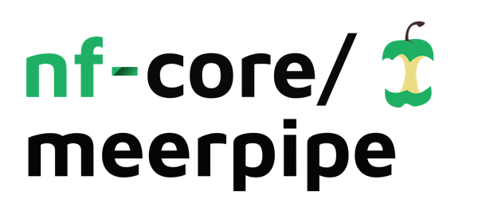
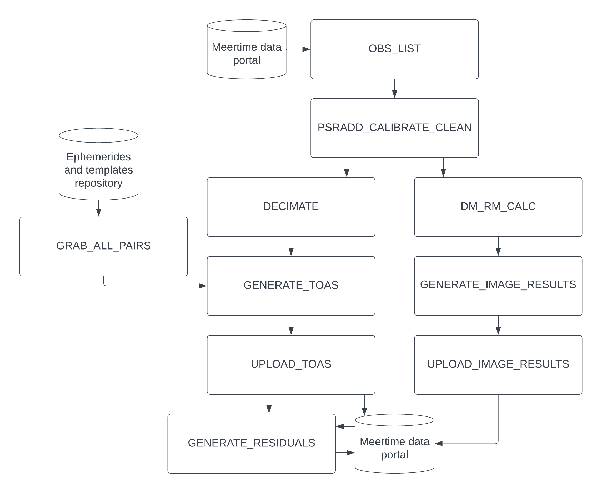

<h1>
  <picture>
    <source media="(prefers-color-scheme: dark)" srcset="docs/images/nf-core-meerpipe_logo_dark.png">
    
  </picture>
</h1>

[](https://github.com/nf-core/meerpipe/actions/workflows/ci.yml)
[](https://github.com/nf-core/meerpipe/actions/workflows/linting.yml)[](https://nf-co.re/meerpipe/results)[](https://doi.org/10.5281/zenodo.XXXXXXX)
[](https://www.nf-test.com)

[](https://www.nextflow.io/)
[](https://docs.conda.io/en/latest/)
[](https://www.docker.com/)
[](https://sylabs.io/docs/)
[](https://tower.nf/launch?pipeline=https://github.com/nf-core/meerpipe)

[](https://nfcore.slack.com/channels/meerpipe)[](https://twitter.com/nf_core)[](https://mstdn.science/@nf_core)[](https://www.youtube.com/c/nf-core)

## Introduction

**nf-core/meerpipe** is a astronomy pipeline that processes MeerKAT pulsar data to produce images and data products for pulsar timing analysis as part of the [MeerTime project](http://www.meertime.org/) ([Bailes et al. 2020](https://ui.adsabs.harvard.edu/abs/2020PASA...37...28B/abstract)).
The images and results are uploaded to the [Meertime data portal](https://pulsars.org.au) where the observation quality can be checked before downloading the results and pulse Time of Arrivals (ToA) using [psrdb](https://psrdb.readthedocs.io/en/latest/).

The pipeline is described by the following flow diagram and bullet points:



1. [OBS_LIST](modules/local/obs_list.nf): Queries the MeerTime database for observations that match the input filters (described in the usage section), download their metadata and find the corresponding ephemerides and template files from the [private repository](https://ozgrav.github.io/meerkat_pulsar_docs/ephem_template/).
2. [PSRADD_CALIBRATE_CLEAN](modules/local/psradd_calibrate_clean.nf): Prepares a cleaned and calibrated archive in the following steps:
    1. Combine the raw archives, except for the first and last ~8 second subint, and clean them of RFI with [MeerGuard](https://github.com/danielreardon/MeerGuard)
    2. Combine the cleaned chunks into a single file and calibrate the polarisation with [pac](https://psrchive.sourceforge.net/manuals/pac/) using the Jones matrices provided by the South African Radio Astronomy Observatory (SARAO) ([Serylak et al. 2020](https://ui.adsabs.harvard.edu/abs/2021MNRAS.505.4483S/abstract))
    3. Apply the rotation measure from the [ATNF](https://www.atnf.csiro.au/research/pulsar/psrcat/) and apply it with [pam](https://psrchive.sourceforge.net/manuals/pam/)
    4. Correct for delays using [dlyfix](https://github.com/OZGrav/meerpipe/blob/main/meerpipe/scripts/dlyfix.py)
    5. Calibrate for the flux (adjust the archive values so they are in flux units) using [fluxcal_meerkat](https://github.com/OZGrav/meerpipe/blob/main/meerpipe/scripts/fluxcal_meerkat.py). Meerpipe uses a bootstrap method to flux calibrate the data. Using the sky map in [Calabretta et al. (2014)](https://ui.adsabs.harvard.edu/abs/2014PASA...31....7C/abstract), an initial estimate of the Tsky is computed. However owing to the large disparity in the sky map as comparted to the more resolved MeerKAT beam, a secondary estimate of Tsky is performed directly from the data. This was done by observing a high-latitude pulsar and comparing its RMS with other pulsars observed in that session. This allowed an estimate of a scaling factor used to flux calibrate the data. A detailed description of this method can be found in the TPA census paper.
    6. Calculate the signal-to-noise ratio (S/N) using [psrstat](https://psrchive.sourceforge.net/manuals/psrstat/)
    7. Calculate the flux density using [pdv](https://psrchive.sourceforge.net/manuals/pdv/)
3. [DM_RM_CALC](modules/local/dm_rm_calc.nf): Calculate the dispersion measure (DM) and rotation measure (RM).
    - For observations with a S/N over 20:
        1. ToAs are created ([pat](https://psrchive.sourceforge.net/manuals/pat/)) from a time scrunched and 16 frequency channel archive ([pam](https://psrchive.sourceforge.net/manuals/pam/))
        2. The ToAs are used to calculate the DM with [tempo2](https://bitbucket.org/psrsoft/tempo2/src/master/)
        3. The RM is calculated with [rmfit](https://psrchive.sourceforge.net/manuals/rmfit/) (this has known issues with inaccurate fitting)
    - For observations with a S/N under 20:
        1. The DM is calculated with [pdmp](https://psrchive.sourceforge.net/manuals/pdmp/)
        2. The RM is not calculated.
    - No template available for the observations or other methods have failed:
        1. The DM and RM are not calculated.
4. [GENERATE_IMAGE_RESULTS](modules/local/generate_image_results.nf): Generate the images (described in the output section) and combine results into a `results.json` file:
    1. Generate the images using [psrplot](https://psrchive.sourceforge.net/manuals/psrplot/)
    2. Generate additional images that require Python using [generate_image_results](https://github.com/OZGrav/meerpipe/blob/main/meerpipe/scripts/generate_images_results.py) which includes dynamic spectrum images created using [scintools](https://github.com/danielreardon/scintools)
    3. Combine the results into a `results.json` file
5. [UPLOAD_IMAGE_RESULTS](modules/local/upload_image_results.nf): Upload the images and `results.json` to the [Meertime data portal](https://pulsars.org.au)
6. [GRAB_ALL_PAIRS](modules/local/grab_all_pairs.nf): Grab all pairs of ephemerides and template files from the [private repository](https://ozgrav.github.io/meerkat_pulsar_docs/ephem_template/) for each pulsar and project. These will be used to create different ToAs for each project.
7. [DECIMATE](modules/local/decimate.nf): Remove the edge frequency channels with [chop_edge_channels](https://github.com/OZGrav/meerpipe/blob/main/meerpipe/scripts/chop_edge_channels.py) then decimate the archives with [pam](https://psrchive.sourceforge.net/manuals/pam/) for each of the combinations of the following params:
    - `nchan`: Number of frequency channels, default [1, 16, 29, 58, 116, 928]
    - `npol`: Polarisation scrunched (1) and full stokes (4), default [1, 4]
    - nsub (controlled with `use_max_nsub`): Number of time subintegrations. A time scrunched (1) and the largest value of nsub possible while maintaining sensitive ToAs (calculated with [calc_max_nsub](https://github.com/OZGrav/meerpipe/blob/main/meerpipe/scripts/calc_max_nsub.py)), default  [1, max]
8. [GENERATE_TOAS](modules/local/generate_toas.nf): Generate ToAs for each combination projects and decimated archives using [pat](https://psrchive.sourceforge.net/manuals/pat/)
9. [UPLOAD_TOAS](modules/local/upload_toas.nf): Upload the ToAs to the [Meertime data portal](https://pulsars.org.au)
10. [GENERATE_RESIDUALS](modules/local/generate_residuals.nf): Once all the UPLOAD_TOA jobs are complete, one of these process will be launched for each pulsar and project. It will download all the ToAs (including those from previous pipeline runs) and generate residuals for each combination of projects and decimated archives using [tempo2](https://bitbucket.org/psrsoft/tempo2/src/master/). These residuals will be uploaded to the [Meertime data portal](https://pulsars.org.au) to allow researchers to interactively check the quality of the observations.

## Usage

> [!NOTE]
> If you are new to Nextflow and nf-core, please refer to [this page](https://nf-co.re/docs/usage/installation) on how to set-up Nextflow. Make sure to [test your setup](https://nf-co.re/docs/usage/introduction#how-to-run-a-pipeline) with `-profile test` before running the workflow on actual data.

<!-- TODO nf-core: Describe the minimum required steps to execute the pipeline, e.g. how to prepare samplesheets.
     Explain what rows and columns represent. For instance (please edit as appropriate):

First, prepare a samplesheet with your input data that looks as follows:

`samplesheet.csv`:

```csv
sample,fastq_1,fastq_2
CONTROL_REP1,AEG588A1_S1_L002_R1_001.fastq.gz,AEG588A1_S1_L002_R2_001.fastq.gz
```

Each row represents a fastq file (single-end) or a pair of fastq files (paired end).

-->

Now, you can run the pipeline using:

<!-- TODO nf-core: update the following command to include all required parameters for a minimal example -->

```bash
nextflow run nf-core/meerpipe \
   -profile <docker/singularity/.../institute> \
   --outdir <OUTDIR> \
   --pulsar J1410-7404 \
   --utcs 2020-09-05-10:00:47 \
   --utce 2020-09-05-10:00:47
```

> [!WARNING]
> Please provide pipeline parameters via the CLI or Nextflow `-params-file` option. Custom config files including those provided by the `-c` Nextflow option can be used to provide any configuration _**except for parameters**_;
> see [docs](https://nf-co.re/usage/configuration#custom-configuration-files).

For more details and further functionality, please refer to the [usage documentation](https://nf-co.re/meerpipe/usage) and the [parameter documentation](https://nf-co.re/meerpipe/parameters).

## Pipeline output

To see the results of an example test run with a full size dataset refer to the [results](https://nf-co.re/meerpipe/results) tab on the nf-core website pipeline page.
For more details about the output files and reports, please refer to the
[output documentation](https://nf-co.re/meerpipe/output).

## Credits

nf-core/meerpipe was originally written by Nick Swainston.

We thank the following people for their extensive assistance in the development of this pipeline:

<!-- TODO nf-core: If applicable, make list of people who have also contributed -->

## Contributions and Support

If you would like to contribute to this pipeline, please see the [contributing guidelines](.github/CONTRIBUTING.md).

For further information or help, don't hesitate to get in touch on the [Slack `#meerpipe` channel](https://nfcore.slack.com/channels/meerpipe) (you can join with [this invite](https://nf-co.re/join/slack)).

## Citations

<!-- TODO nf-core: Add citation for pipeline after first release. Uncomment lines below and update Zenodo doi and badge at the top of this file. -->
<!-- If you use nf-core/meerpipe for your analysis, please cite it using the following doi: [10.5281/zenodo.XXXXXX](https://doi.org/10.5281/zenodo.XXXXXX) -->

<!-- TODO nf-core: Add bibliography of tools and data used in your pipeline -->

An extensive list of references for the tools used by the pipeline can be found in the [`CITATIONS.md`](CITATIONS.md) file.

You can cite the `nf-core` publication as follows:

> **The nf-core framework for community-curated bioinformatics pipelines.**
>
> Philip Ewels, Alexander Peltzer, Sven Fillinger, Harshil Patel, Johannes Alneberg, Andreas Wilm, Maxime Ulysse Garcia, Paolo Di Tommaso & Sven Nahnsen.
>
> _Nat Biotechnol._ 2020 Feb 13. doi: [10.1038/s41587-020-0439-x](https://dx.doi.org/10.1038/s41587-020-0439-x).
